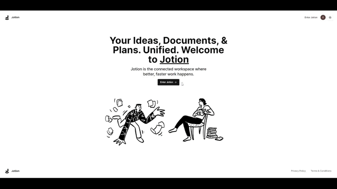
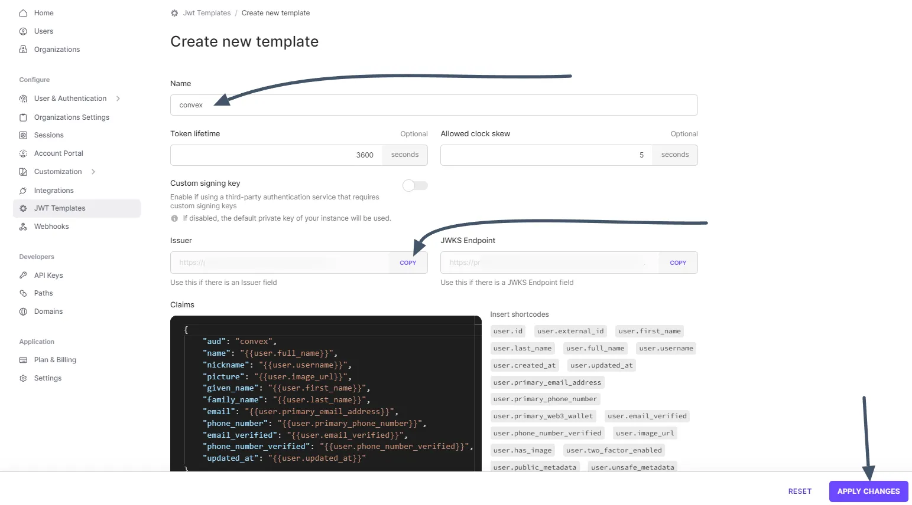

# app-notionclone-2023

[](https://choosealicense.com/licenses/mit/) 
  

## _About_

**Name:** Notion Clone  
**Year:** 2023  
**Info:** [](https://dandelion-appeal-fd9.notion.site/app-notionclone-2023-cccb22fc367442099ba86f296cb2e6e8)  
**Idea:** [](https://github.com/AntonioErdeljac)  
**Source:** [](https://www.youtube.com/@codewithantonio)  
**Description:** This project is a clone of the popular productivity app, Notion. It aims to replicate the core features of Notion, providing users with a platform to manage their notes, tasks, and more in one place.  
**Deploy:** [](https://vercel.com/)  

## _Tech stack_

[](https://bun.sh/) 
[](https://www.typescriptlang.org/) 
[](https://nextjs.org/) 
[](https://legacy.reactjs.org/) 
[](https://tailwindcss.com/) 
[](https://vercel.com/) 
[](https://www.docker.com/) 
[](https://eslint.org/) 
[](https://ui.shadcn.com/) 
[](https://www.convex.dev/) 
[](https://clerk.com/) 
[](https://zustand-demo.pmnd.rs/) 
[](https://edgestore.dev/)  

## _Deploy_

[](https://app-notionclone-2023.vercel.app/)  
<a href="https://app-notionclone-2023.vercel.app/"></a>

## _Features_

This Notion clone has a wide range of features designed to provide a comprehensive and user-friendly note-taking experience:

- **Real-time Database**: The application uses a real-time database, ensuring that your data is always up-to-date. 🔗
- **Notion-style Editor**: Enjoy a seamless writing experience with our Notion-style editor. 📝
- **Light and Dark Mode**: Choose between light and dark mode for a comfortable viewing experience. 🌓
- **Infinite Children Documents**: Create an unlimited number of child documents. 🌲
- **Trash Can & Soft Delete**: Deleted something by mistake? Don't worry, our trash can feature and soft delete option have got you covered. 🗑️
- **Authentication**: Keep your notes secure with our authentication feature. 🔐
- **File Management**: Upload, delete, or replace files with ease.
- **Document Icons**: Personalize your documents with icons that change in real-time. 🌠
- **Expandable Sidebar**: Easily navigate through your notes with our expandable sidebar. ➡️🔀⬅️
- **Mobile Responsiveness**: Take notes on the go with our fully responsive mobile design. 📱
- **Publish Your Note to the Web**: Share your thoughts with the world by publishing your note to the web. 🌐
- **Fully Collapsible Sidebar**: Save space with our fully collapsible sidebar. ↕️
- **Landing Page**: Get started on our user-friendly landing page. 🛬
- **Cover Image for Each Document**: Customize each document with a unique cover image. 🖼️
- **Recover Deleted Files**: Accidentally deleted a file? Easily recover it with our file recovery feature. 🔄📄

## _Install_

#### **1. Clone this repository into your system**  

> **Required:** git


```
git clone https://github.com/zhenya-paitash/app-notionclone-2023.git
```

#### **2 . Go to this folder**  


```
cd app-notionclone-2023
```

#### **3. Create ".env.local" config file at the root of the project**

```
mv .env.local.example .env.local
```

  


#### **4. Create an account in the services and get the necessary data for the application**

> **Required:**
    [](https://www.convex.dev/) 
    [](https://clerk.com/) 
    [](https://edgestore.dev/)  

---

##### 4.1 [**Convex**](https://www.convex.dev/)  

- **4.1.1.** Go to the website (https://www.convex.dev/) and create an account  

- **4.1.2.** Go to dashboard and create a **new project**  

      

- **4.1.3.** Go to **Settings** -> **URL and Deploy Key** -> **Create a production deployment...**  

      

- **4.1.4.** After switching to *PROD*, go to **Settings** -> **URL and Deploy Key** -> copy all the necessary data as shown in the screenshot and paste them into the **.env.local** file  

      

---

#### 4.2 [**Clerk**](https://clerk.com/)  

- **4.2.1.** Go to the website (https://clerk.com/) and create an account  

      

- **4.2.2.** Copy and paste API Keys into **.env.local** file  

      

- **4.2.3.** Go to **JWT Templates** -> **Create new JWT Template** -> **Convex**  

      

- **4.2.4.** Copy **"Issuer"** and paste into **convex/auth.config.js** in the **convex.domain** value  
    
      
      

---

#### 4.3 [**Edgestore**](https://edgestore.dev/)  

- **4.3.1.** Go to the website (https://edgestore.dev/) and create an account  

      

- **4.3.2.** Create new Project and copy **EDGE_** values into **.env.local** file  

      

---

#### **5. Build and start**  

##### **Run locally on your computer**

> **Required:** Bun (or Node.js)  

- **5.1.** Install all requirements, build project, deploy database configuration  

    ```
    bun install && bun run build && bun run db:deploy
    ```

- **5.2.** Start a project


    ```
    bun run start
    ```

##### **Run in Docker**

> **Required:** Docker  

- **5.1** Build image  

    ```
    docker build -t app-notionclone-2023 .
    ```

- **5.1** Run container  

    ```
    docker run -d -p 3000:3000 --name notionclone app-notionclone-2023
    ```

## _Workflow_

- [x] Introduction
- [x] Environment setup
- [x] Folders setup
- [x] Landing page
- [x] Authentication & Database
- [x] Sidebar
- [x] User Settings
- [x] Schema & API
- [x] Sidebar Item
- [x] Document list
- [x] Archive functionality
- [x] Trash box
- [x] Search functionality
- [x] Settings
- [x] Navbar
- [x] Banner component
- [x] Toolbar component (Icon, Title)
- [x] Cover image (File upload)
- [x] Advanced file upload (delete, replace)
- [x] Editor component
- [x] Preview functionality (Publish your work)
- [x] Deployment
- [x] Docker setup
- [x] Documentation

## _ASCII_

                                                        888    d8b                            888                                    .d8888b.   .d8888b.   .d8888b.   .d8888b.  
                                                        888    Y8P                            888                                   d88P  Y88b d88P  Y88b d88P  Y88b d88P  Y88b 
                                                        888                                   888                                          888 888    888        888      .d88P 
     8888b.  88888b.  88888b.         88888b.   .d88b.  888888 888  .d88b.  88888b.   .d8888b 888  .d88b.  88888b.   .d88b.              .d88P 888    888      .d88P     8888"  
        "88b 888 "88b 888 "88b        888 "88b d88""88b 888    888 d88""88b 888 "88b d88P"    888 d88""88b 888 "88b d8P  Y8b         .od888P"  888    888  .od888P"       "Y8b. 
    .d888888 888  888 888  888 888888 888  888 888  888 888    888 888  888 888  888 888      888 888  888 888  888 88888888 888888 d88P"      888    888 d88P"      888    888 
    888  888 888 d88P 888 d88P        888  888 Y88..88P Y88b.  888 Y88..88P 888  888 Y88b.    888 Y88..88P 888  888 Y8b.            888"       Y88b  d88P 888"       Y88b  d88P 
    "Y888888 88888P"  88888P"         888  888  "Y88P"   "Y888 888  "Y88P"  888  888  "Y8888P 888  "Y88P"  888  888  "Y8888         888888888   "Y8888P"  888888888   "Y8888P"  
             888      888                                                                                                                                                       
             888      888                                                                                                                                                       
             888      888

## _License_

[MIT](https://choosealicense.com/licenses/mit/)
